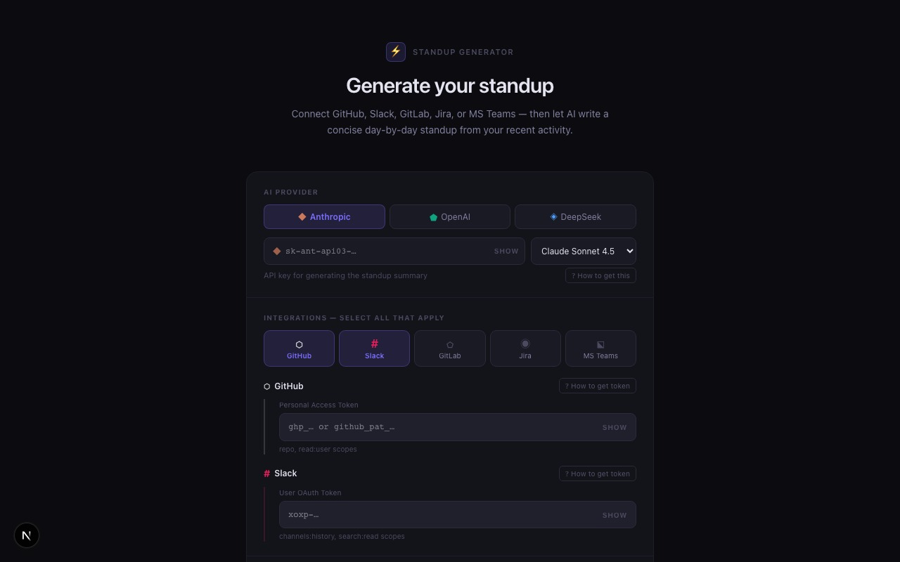
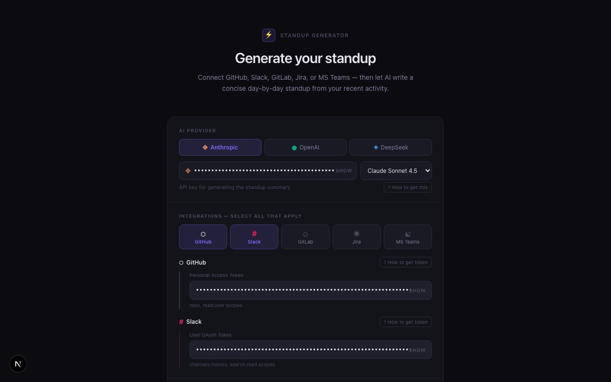
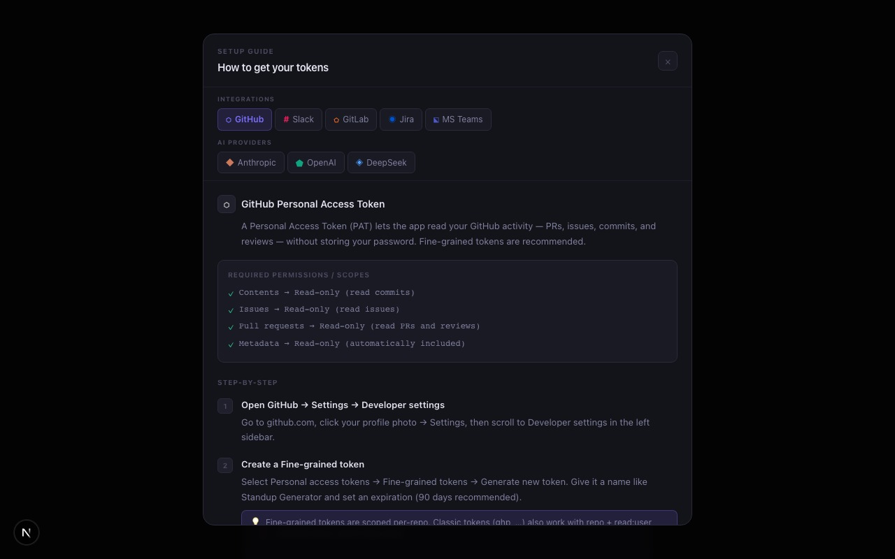
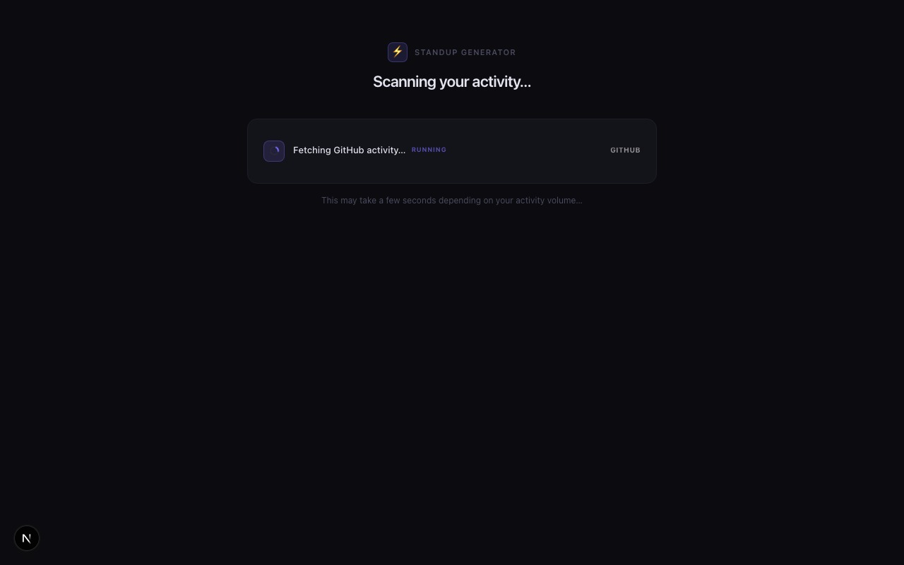
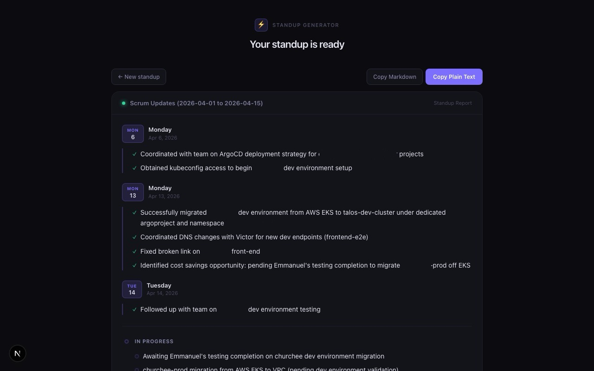
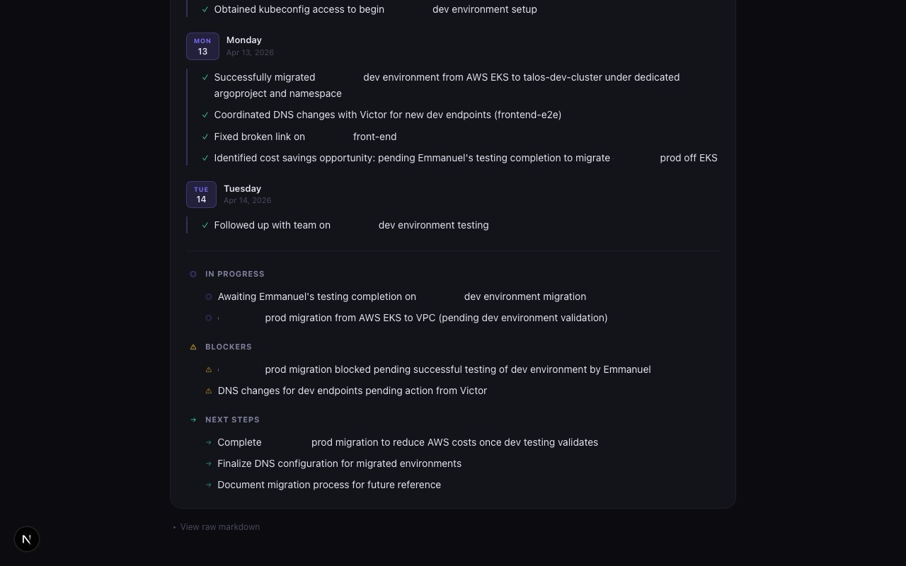

<div align="center">

# ⚡ Standup Generator

**Generate professional, day-by-day scrum standup updates from your real activity — automatically.**

Connect your tools, paste your tokens, and get a clean standup in seconds. No accounts, no subscriptions, no data stored.



</div>

---

## What it does

Standup Generator scans your GitHub, Slack, GitLab, Jira, and MS Teams activity over a chosen time window, then uses an AI model of your choice to write a concise, day-by-day standup update — with real links to every PR, issue, and commit.

The output follows this format:

```
Scrum Updates (2026-04-01 to 2026-04-15)

## Monday (2026-04-06)
- Lorem ipsum dolor sit amet, consectetur adipiscing elit.
- Lorem ipsum dolor sit amet, consectetur adipiscing elit.
- 
## Monday (2026-04-13)
- Lorem ipsum dolor sit amet, consectetur adipiscing elit.
- Lorem ipsum dolor sit amet, consectetur adipiscing elit.

## In Progress
- Lorem ipsum dolor sit amet, consectetur adipiscing elit.
- Lorem ipsum dolor sit amet, consectetur adipiscing elit.

## Blockers
- Lorem ipsum dolor sit amet, consectetur adipiscing elit.
 
## Next Steps
- Lorem ipsum dolor sit amet, consectetur adipiscing elit.
- Lorem ipsum dolor sit amet, consectetur adipiscing elit.
```

---

## Integrations

| Integration | What gets pulled | Token type |
|---|---|---|
| **GitHub** | Pull requests (authored/merged/reviewed), issues you're involved in, commits | Personal Access Token (`ghp_…` or `github_pat_…`) |
| **Slack** | Messages you sent across channels, DMs, threads | User OAuth Token (`xoxp-…`) |
| **GitLab** | Merge requests (authored/reviewed), issues, push commits | Personal Access Token (`glpat-…`) |
| **Jira** | Issues assigned to or reported by you, worklogs, status changes | Email + API Token |
| **MS Teams** | Chat messages, group DMs, Teams channel messages | Microsoft Graph API Bearer Token |

All integrations are **optional** — enable only the ones you use.

---

## AI Providers

| Provider | Models |
|---|---|
| **Anthropic Claude** | Claude Sonnet 4.5, Opus 4.5, Haiku 4.5 |
| **OpenAI** | GPT-4o, GPT-4o Mini, GPT-4 Turbo, o3-mini |
| **DeepSeek** | DeepSeek Chat (V3), DeepSeek Reasoner (R1) |

Your API key is used only for the generation request and is never stored.

---

## Screenshots

### 1 — Configure your tokens

Select your AI provider and model, enable the integrations you use, then choose a lookback period.



---

### 2 — Built-in setup guide

Every field has a **? How to get token** button that opens a detailed, step-by-step guide with required scopes and direct links — for all 8 services.



---

### 3 — Live scanning progress

Each service is scanned in sequence with real-time status updates and a summary of what was found.



---

### 4 — Day-by-day standup output

Work is grouped by the day it happened. Every PR, issue, commit, and ticket is a clickable link.



---

### 5 — In Progress · Blockers · Next Steps

Below the daily breakdown, the standup covers what's ongoing, what's blocked, and what's next.



---

## Getting started

### Prerequisites

- [Node.js](https://nodejs.org/) 18 or later
- API tokens for at least one integration and one AI provider

### Install and run

```bash
git clone https://github.com/1zyik/standup.git
cd standup
npm install
npm run dev
```

Open [http://localhost:3000](http://localhost:3000).

---

## Cost Per Standup
| Provider | Cost Per Standup |
|---|---|
| **Anthropic** | ~$0.01–0.03 |
| **OpenAI** | Not tested |
| **DeepSeek** | 

---

## Lookback period

Choose a preset — **3d · 7d · 14d · 21d** — or set a **custom date range**. Custom ranges are capped at 14 days to keep scans fast and output focused.

---

## Output format

**Day sections** (one per active day, chronological):
- Only days with actual activity are shown — no empty padding
- Every item links directly to its source (PR, MR, issue, commit, Jira ticket, Slack message)

**Trailing sections** (always present):
| Section | Content |
|---|---|
| **In Progress** | Active, ongoing work items |
| **Blockers** | Impediments, things waiting on others |
| **Next Steps** | Concrete, actionable planned work |

Use **Copy Plain Text** to paste into Slack or email. Use **Copy Markdown** to paste into Notion, GitHub comments, or Linear.

---

## Privacy

- **No data is stored.** Tokens and activity data exist only in memory for the duration of your session.
- **Tokens are never logged** or written to disk.
- Activity data is sent to your chosen AI provider for the generation request, subject to their privacy policies:
  [Anthropic](https://www.anthropic.com/privacy) · [OpenAI](https://openai.com/policies/privacy-policy) · [DeepSeek](https://www.deepseek.com/privacy)

---

## Tech stack

| Layer | Technology |
|---|---|
| Framework | Next.js 16 (App Router, TypeScript) |
| Styling | Tailwind CSS + CSS custom properties |
| AI | Anthropic SDK · OpenAI-compatible REST (OpenAI, DeepSeek) |
| GitHub | GitHub REST API v3 — search + user events |
| Slack | Slack Web API — `search.messages` + `conversations.history` |
| GitLab | GitLab REST API v4 |
| Jira | Jira REST API v3 (Basic Auth) |
| MS Teams | Microsoft Graph API v1.0 |

---

## License

MIT
